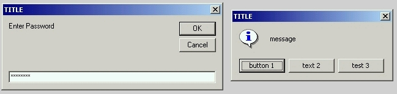

<div align="center">

## Custom MessageBox And Password InputBox


</div>

### Description

MessageBox with custom text on buttons,

InputBox for password input with 

----

,
 
### More Info
 


<span>             |<span>
---                |---
**Submitted On**   |
**By**             |[Serge Lachapelle](https://github.com/Planet-Source-Code/PSCIndex/blob/master/ByAuthor/serge-lachapelle.md)
**Level**          |Intermediate
**User Rating**    |4.8 (24 globes from 5 users)
**Compatibility**  |VB 5\.0, VB 6\.0
**Category**       |[VB function enhancement](https://github.com/Planet-Source-Code/PSCIndex/blob/master/ByCategory/vb-function-enhancement__1-25.md)
**World**          |[Visual Basic](https://github.com/Planet-Source-Code/PSCIndex/blob/master/ByWorld/visual-basic.md)
**Archive File**   |[](https://github.com/Planet-Source-Code/serge-lachapelle-custom-messagebox-and-password-inputbox__1-63456/archive/master.zip)


### Source Code

```
Option Explicit
Private Declare Function GetCurrentThreadId Lib "kernel32" () As Long
Private Declare Function SetWindowsHookEx Lib "user32" Alias "SetWindowsHookExA" (ByVal idHook As Long, ByVal lpfn As Long, ByVal hmod As Long, ByVal dwThreadId As Long) As Long
Private Declare Function UnhookWindowsHookEx Lib "user32" (ByVal hHook As Long) As Long
Private Declare Function FindWindowEx Lib "user32.dll" Alias "FindWindowExA" (ByVal hwndParent As Long, ByVal hwndChildAfter As Long, ByVal lpszClass As String, ByVal lpszWindow As String) As Long
Private Declare Function SetWindowText Lib "user32.dll" Alias "SetWindowTextA" (ByVal HWND As Long, ByVal lpString As String) As Long
Private Declare Function GetClassName Lib "user32.dll" Alias "GetClassNameA" (ByVal HWND As Long, ByVal lpClassName As String, ByVal nMaxCount As Long) As Long
Private Declare Function SendMessage Lib "user32.dll" Alias "SendMessageA" (ByVal HWND As Long, ByVal wMsg As Long, ByVal wParam As Long, lParam As Any) As Long
Private Const HCBT_ACTIVATE = 5
Private Const WH_CBT = 5
Private hHook As Long, ButtonText(3) As String, PasswordChar As Byte
Private Function ChangeButtonsText(ByVal lMsg As Long, ByVal wParam As Long, ByVal lParam As Long) As Long
 Dim t As Integer, cName As String, Length As Long, Btn(0 To 3) As Long
 If lMsg = HCBT_ACTIVATE Then
  Btn(0) = FindWindowEx(wParam, 0, vbNullString, vbNullString)
  For t = 1 To 3
   Btn(t) = FindWindowEx(wParam, Btn(t - 1), vbNullString, vbNullString)
   If Btn(t) = 0 Then Exit For
  Next t
  For t = 0 To 3
   If (Btn(t) <> 0) And (Btn(t) <> wParam) Then
    cName = Space(255)
    Length = GetClassName(Btn(t), cName, 255)
    cName = Left(cName, Length)
    If UCase(cName) = "BUTTON" Then
     If ButtonText(t) <> vbNullString Then SetWindowText Btn(t), ButtonText(t)
    End If
   End If
  Next t
  UnhookWindowsHookEx hHook
 End If
 ChangeButtonsText = False
End Function
Private Function SetPasswordChar(ByVal lMsg As Long, ByVal wParam As Long, ByVal lParam As Long) As Long
 Const EM_SETPASSWORDCHAR As Long = &HCC
 Dim t As Integer, cName As String, Length As Long, Btn(0 To 3) As Long
 If lMsg = HCBT_ACTIVATE Then
  Btn(0) = FindWindowEx(wParam, 0, vbNullString, vbNullString)
  For t = 1 To 3
   Btn(t) = FindWindowEx(wParam, Btn(t - 1), vbNullString, vbNullString)
   If Btn(t) = 0 Then Exit For
  Next t
  For t = 0 To 3
   If (Btn(t) <> 0) And (Btn(t) <> wParam) Then
    cName = Space(255)
    Length = GetClassName(Btn(t), cName, 255)
    cName = Left(cName, Length)
    If LCase$(cName) = "edit" Then SendMessage Btn(t), EM_SETPASSWORDCHAR, ByVal PasswordChar, ByVal 0&
   End If
  Next t
  UnhookWindowsHookEx hHook
 End If
 SetPasswordChar = False
End Function
Public Function CustomMsgBox(ByVal zMessage As String, Optional ByVal zButtons As VbMsgBoxStyle = vbOKOnly, Optional ByVal zTitle As String = vbNullString, Optional ByVal Button1Text As String = vbNullString, Optional ByVal Button2Text As String = vbNullString, Optional ByVal Button3Text As String = vbNullString) As VbMsgBoxResult
 Dim Thread As Long
 ButtonText(0) = Button1Text
 ButtonText(1) = Button2Text
 ButtonText(2) = Button3Text
 Thread = GetCurrentThreadId()
 hHook = SetWindowsHookEx(WH_CBT, AddressOf ChangeButtonsText, ByVal 0&, Thread)
 If zTitle = vbNullString Then
  CustomMsgBox = MsgBox(zMessage, zButtons)
 Else
  CustomMsgBox = MsgBox(zMessage, zButtons, zTitle)
 End If
End Function
Public Function PasswordBox(ByVal zMessage As String, Optional ByVal zTitle As String = vbNullString, Optional ByVal zPasswordChar As Byte = 42) As String
 Dim Thread As Long
 PasswordChar = zPasswordChar
 Thread = GetCurrentThreadId()
 hHook = SetWindowsHookEx(WH_CBT, AddressOf SetPasswordChar, ByVal 0&, Thread)
 If zTitle = vbNullString Then
  PasswordBox = InputBox(zMessage)
 Else
  PasswordBox = InputBox(zMessage, zTitle)
 End If
End Function
```

